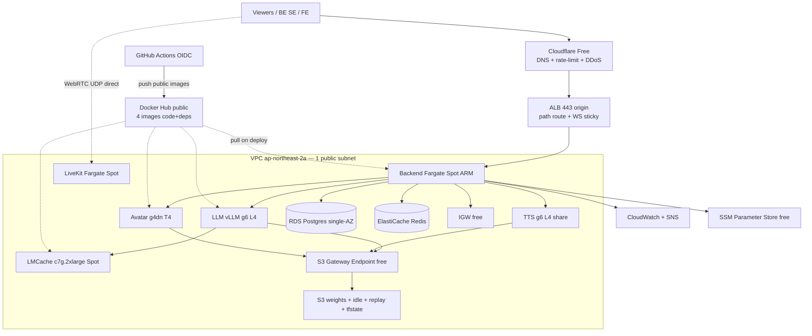

# AWS Production Architecture — ai-livestream-commerce-vn

> Status: **CONFIRMED design — ready to implement** (2026-07-11).
> Region: **ap-northeast-2 (Seoul)**.
> Mode: co-worker + "my money is your money" — every service compared, ONE chosen option.
> Companions: `brief-for-confirmation.md`, `scope-engine-and-models.md`, `aws-pricing-seoul.csv`, `cicd-branch-strategy.md`, `terraform-layout.md`.
> **MVP = prod**. Single-AZ. Public-subnet only (no NAT). Cloudflare Free edge. Docker Hub public images + S3 weights.

---

## 1. Confirmed scope

| # | Role | Compute | Notes |
|---|---|---|---|
| 1 | LLM + TTS (share 1 GPU) | EC2 Spot `g6.xlarge` L4 24GB | 2 containers / 1 ECS Task, GPU 0.6/0.25 |
| 2 | Avatar | EC2 Spot `g4dn.xlarge` T4 16GB | LiveKit video publish |
| 3 | Backend API | Fargate Spot ARM64 1vCPU+2GB | FastAPI + Pipecat + Director |
| 4 | LiveKit SFU | Fargate Spot ARM64 2vCPU+4GB | WebRTC UDP |
| 5 | Postgres | RDS `db.t4g.medium` single-AZ + 100GB gp3 | compute ≠ storage (separate bill) |
| 6 | Redis | ElastiCache `cache.t4g.small` | ChatQueue + locks |
| 7 | LMCache-server | EC2 Spot `c7g.2xlarge` ASG | stateful warm KV; env `LMCACHE_ENABLED` |

Edge / registry / secrets:
- **Cloudflare Free** — DNS + rate-limit + DDoS (replaces Route53 + AWS WAF)
- **ALB** — path routing + TLS origin + WS sticky (still required)
- **Docker Hub public** — 4 images code+deps only (no ECR MVP)
- **S3** — model weights, idle-frames, replays, tfstate
- **SSM Parameter Store SecureString** — free secrets (no Secrets Manager MVP)

---

## 2. Service decisions (with rejections)

### 2.1 Compute

**ECS** — free control plane. Reject EKS ($73/mo + ops), App Runner (no GPU), Lambda (no GPU/long-lived), Compose-on-EC2 (no replace/service discovery).

**GPU = EC2 Spot** g6 + g4dn. Reject SageMaker (~30% premium), Bedrock (cannot run Qwen AWQ).

**Backend + LiveKit = Fargate Spot ARM64**. Why not EC2 for them?
- Backend 1vCPU+2GB: Fargate Spot ~$11/mo vs smallest useful c7g.large Spot ~$28/mo (over-provision).
- Stateless → Spot reclaim OK (ECS replaces ~30s).
- Zero AMI/OS patch.

**LMCache only on EC2 c7g Spot ASG** (not Fargate):
- Yes, c7g = **EC2 ARM Spot**.
- Needs **stateful** warm KV in RAM. Fargate reclaim = cache wipe = miss storm.
- ASG capacity-rebalance gives ~2 min warning to launch replacement first.
- Needs 16GB RAM class → c7g.2xlarge. Toggle off via `LMCACHE_ENABLED=false` → desired_count=0.

### 2.2 Network — PUBLIC SUBNET ONLY (confirmed)

| Item | Decision |
|---|---|
| Subnets | **2 public subnets** across AZs (`ap-northeast-2a` + `ap-northeast-2b`) — **no private subnet** |
| NAT Gateway | **REJECTED** (−$43.5/mo) |
| Private subnet | **REJECTED** |
| VPC Endpoints Interface | **REJECTED** (no need without private) |
| S3 Gateway Endpoint | **KEEP** (free, private path to S3 even from public subnet) |
| IGW | KEEP (free) |

**Public subnet ≠ public access.** Security model:

1. **Security Groups** (stateful, free) — only ALB:443 and LiveKit UDP public; all else SG→SG.
2. **RDS** `publicly_accessible=false` — no public IP even in public subnet.
3. **ElastiCache** — no public endpoint ever.
4. **No SSH / no key pair** — troubleshoot via **ECS Exec + SSM Session Manager** (free, audited).
5. **IMDSv2 required** on EC2 (`http_tokens=required`) — block SSRF metadata theft.
6. **CI guard**: fail deploy if any SG has `0.0.0.0/0` on non-443/non-UDP-media ports.
7. **VPC Flow Logs** free tier 10GB/mo.
8. **App middleware**: auth, rate-limit, request-id, CORS whitelist, constant-time token compare.

**Why 2 public subnets (not multi-AZ HA):** AWS **ALB** and **RDS DB subnet groups** require subnets in **≥2 AZs**. Second public subnet (`2b`) is only an AZ-span requirement. Workload still **single-AZ pin** on `2a` (backend/GPU cost model unchanged). This is **not** private subnet, **not** NAT, **not** Multi-AZ RDS standby.

### 2.3 ALB + LCU (keep) vs API Gateway (reject)

**LCU** = Load Balancer Capacity Unit. ALB bill = hourly + LCU-hr.

LCU = max of 4 dimensions (new conn/s, active conn, bytes/hr, rule evals/s).
MVP estimate ~5 LCU → ~$29/mo + hourly ~$18 → **~$47–50/mo**.

**Why keep ALB**: path routing (`/api/*` backend, future `/v1/chat` llm), WS sticky, health checks, ECS integration, origin for Cloudflare.

**Why not API Gateway**:
- Per-request pricing worse for long-lived SSE/WS livestream profile.
- REST API 29s integration timeout breaks streaming.
- Would still need ALB/origin for ECS services → double hop, more money.
- Reconsider only if request count explodes (>10M/mo).

### 2.4 Cloudflare Free replaces Route53 + AWS WAF (confirmed)

| | AWS | Cloudflare Free |
|---|---|---|
| DNS | Route53 $0.50/zone | Free anycast |
| L7 WAF / rate-limit | WAF ~$2.6/mo | Free (1 rate rule basic) |
| DDoS | Shield Standard free L3/4 | Free L3/4/7 basic |
| Extra hop | none | +10–50ms (OK vs 300ms Director tick / 500ms TTS TTFB) |

LiveKit **media UDP bypasses Cloudflare** (direct to ENI). Only HTTP/WS signaling through CF.

ALB stays as origin. Cloudflare SSL mode **Full (strict)** + ACM/origin cert on ALB.

### 2.5 Docker Hub public — ECR rejected for MVP (confirmed)

**Question:** if Docker Hub repos are **public**, do we still need ECR?

**Answer: No for MVP.**

| | ECR | Docker Hub public |
|---|---|---|
| Storage | $0.10/GB-mo | **$0** |
| Pull from public subnet | free same-region | free via IGW |
| Private image | native | not needed (user confirmed public OK) |
| IAM pull auth | task role native | none needed for public |
| Rate limits | none practical | anonymous 100/6h; free authed 200/6h — enough for 4 services × rare deploys |

**Weights never in image** (confirmed):
- Image = code + deps only (~3–5GB) → fast build/push.
- Weights on **S3** (`s3://ai-livestream-{env}/weights/`) → entrypoint `aws s3 sync` then start vLLM/TTS.
- Cold start deploy/scale +3–30s (same-region S3 fast). Acceptable.
- Baking 10GB weights into image = image +10GB, slow every rebuild, ECR storage burns money.

**When revisit ECR:** need private images (license-restricted weights in image), or Hub rate limits block rolling deploys, or want AWS-only supply chain scanning with IAM.

### 2.6 Data plane services

**RDS Postgres 16** `db.t4g.medium` single-AZ + **100GB gp3**:
- Instance (2 vCPU / 4GB RAM) = **compute** ~$74.46/mo.
- gp3 100GB = **disk** ~$11.50/mo.
- Total ~$86/mo. Multi-AZ rejected (×2 instance cost).

**ElastiCache Redis 7** `cache.t4g.small` single-node ~$12.41/mo.

**SSM Parameter Store SecureString** Standard tier **FREE** (AWS native Systems Manager, not third-party). Secrets Manager rejected until auto-rotation needed.

### 2.7 Observability

CloudWatch Logs + Metrics + Alarms + SNS email. Billing alarms $50/$100. No Grafana MVP.

---

## 3. Security group matrix

| SG | Inbound | Outbound |
|---|---|---|
| `sg-alb` | 443 from Cloudflare IPs (or 0.0.0.0/0 if CF grey-cloud not used) | 8800 → sg-backend |
| `sg-backend` | 8800 from sg-alb | 5432→sg-rds, 6379→sg-redis, 8001/8002/8080→gpu SGs, 443 internet (Hub/S3/HF) |
| `sg-llm` | 8001 from sg-backend | 443 internet, 5555→sg-lmcache |
| `sg-tts` | 8002 from sg-backend | 443 internet |
| `sg-avatar` | 8080 from sg-backend | LiveKit media UDP/TCP, 443 |
| `sg-rds` | 5432 from sg-backend only | none |
| `sg-redis` | 6379 from sg-backend only | none |
| `sg-lmcache` | 5555 from sg-llm | none |
| `sg-livekit` | 443 from sg-alb; UDP 50000-60000 from 0.0.0.0/0 | media UDP |

**Iron rules:** no port 22 anywhere; no `0.0.0.0/0` on DB/Redis/GPU control ports; RDS not publicly accessible.

---

## 4. Architecture diagrams

Rendered artifacts (AWS icon style / best practice layout):

| Artifact | Path / URL |
|---|---|
| Interactive HTML | [`figures/ai-livestream-aws-architecture.html`](./figures/ai-livestream-aws-architecture.html) |
| diagrams (Graphviz AWS icons) PNG | [`figures/ai-livestream-aws-architecture-seoul.png`](./figures/ai-livestream-aws-architecture-seoul.png) |
| Eraser PNG export | [`figures/ai-livestream-aws-architecture-eraser.png`](./figures/ai-livestream-aws-architecture-eraser.png) |
| Eraser workspace | [app.eraser.io/workspace/ZYLtQe5wQbJ8YaeLgYvh](https://app.eraser.io/workspace/ZYLtQe5wQbJ8YaeLgYvh) |



---

## 5. Workflow (control + realtime)

### 5.1 Control plane
```
① POST /sessions → create
② POST /sessions/{id}/plan/create → run plan (optional pre-live)
③ POST /sessions/{id}/attach → products + persona; Director start
④ GET LiveKit token → FE join room
⑤ WS /ws/platform/{sid} ← platform comments/traffic
⑥ WS /ws/control/{sid} → events to BE SE / FE
⑦ POST /sessions/{id}/stop → flush replay S3
```

### 5.2 Realtime tick (~300ms)
```
⑧ ChatQueue.put (Redis XADD)
⑨ Director: drain window → embed → cluster → score → decide
   reactive > proactive plan cursor > product transition > idle
⑩ coverage = Director BiEncoder cosine vs key_selling_points (not LLM self-report)
⑪ LLM SSE → Utterance → TTS PCM → LiveKit audio
⑫ Avatar frames → LiveKit video; idle-loop if no utterance
⑬ audit rows → RDS
```

### 5.3 GPU share / LMCache
Same as before: GPU util 0.6/0.25/0.15 buffer; LMCache ZMQ 5555 when enabled.

---

## 6. CI/CD (confirmed)

Full examples: **`cicd-branch-strategy.md`**.

| Branch | Workflow | Action |
|---|---|---|
| any / PR | `ci.yml` | lint + test + docker build check — **no deploy** |
| `develop` | `deploy-dev.yml` | push Hub tags `dev-*` → ECS dev |
| tag `v*` on `main` | `deploy-prod.yml` | manual approve → Hub `v*`/`latest` → ECS prod |

OIDC: no static AWS keys. Trust locked to repo + ref.

---

## 7. Terraform (confirmed Root & Child)

Full tree + rules: **`terraform-layout.md`**.

```
infra/modules/{network,security,compute,database,loadbalancer,storage,secrets,monitoring}
infra/environments/{global,dev,prod}   # only roots run apply
```

No modules for: NAT, private subnet, Route53, WAF, ECR, Secrets Manager.

---

## 8. Cost — validated Seoul (2026-07-11)

Canonical numbers live in `aws-pricing-seoul.xlsx` / `.csv` (PASS 45/45). Summary:

| Mode | Operating 1m | RI 1y stack | RI 3y stack |
|---|---:|---:|---:|
| **MVP** Spot compute + Single-AZ + LMCache ON | **$699.41** | $1068.38 | $765.76 |
| **PROD** On-Demand + Multi-AZ + LMCache ON | **$1916.07** | $1325.50 | $1005.00 |

MVP operating highlights (LMCache ON): g6 Spot ~$220.49, g4dn Spot ~$177.30, c7g Spot ~$94.44, Backend Fargate Spot ~$9.95, LiveKit Fargate Spot ~$19.90, RDS t4g.medium compute $74.46 + gp3 100GB $13.10, Redis t4g.small $34.31, ALB+~5 LCU ~$45.63, S3/CW/DT residual.

Sources: `aws pricing get-products` + `describe-spot-price-history` ap-northeast-2. Report: `aws-pricing-seoul-validation.md`. Only in-architecture services listed (no unused-service rows).

---

## 9. Rejected list (money/effort)

| Rejected | Why |
|---|---|
| NAT + private subnet | $43+/mo; public subnet + SG lock enough for MVP |
| AWS WAF + Route53 | Cloudflare Free covers DNS + basic L7/DDoS |
| ECR | Docker Hub public $0; weights on S3 |
| Secrets Manager | SSM SecureString free until rotation needed |
| API Gateway | still need ALB; streaming timeouts; per-req pricing |
| EKS / SageMaker / Bedrock | cost or cannot run custom GPU stack |
| Multi-AZ RDS | user single-AZ first |
| Self-host Postgres/Redis | lose backup/PITR for commerce audit data |
| Bake weights into image | +10GB image, slow CI, storage cost |

---

## 10. Upgrade path

| Trigger | Change |
|---|---|
| Paying customer | GPU Spot → On-Demand / mixed |
| Need private images | add ECR (or Hub private) |
| AZ resilience | 2nd public subnet + Multi-AZ RDS |
| Multi stream | LLM desired_count≥2 + LMCACHE_ENABLED=true |
| RDS password auto-rotate | SSM → Secrets Manager |
| Static FE assets | Cloudflare cache rules (already on CF) |
| >10M req/mo | re-evaluate API GW in front of ALB |

---

## 11. Brief gaps closed (middleware etc.)

Must be in Backend (document + implement):

1. **Middleware**: CORS whitelist, request-id, auth, rate-limit, structured error handler, constant-time API key compare.
2. **Health**: `/health` shallow 200; `/health/ready` deep (DB+Redis+LLM+TTS).
3. **Graceful shutdown**: SIGTERM → stop intake → drain in-flight → close pools (ECS `stopTimeout` 30–120s).
4. **Spot reclaim**: optional IMDS rebalance notice → WS event `reconnecting` to FE.
5. **Docker multi-stage**: builder → runtime slim; no weights in layers.
6. **Entrypoint weight sync**: `aws s3 sync` before process exec.
7. **Terraform state lock**: S3 + DynamoDB (in `environments/*/backend.tf`).

---

## 12. Status

**CONFIRMED.** Implement next:
1. `infra/` Terraform Root & Child modules
2. `services/*/Dockerfile` multi-stage + weight entrypoint
3. `.github/workflows/{ci,deploy-dev,deploy-prod}.yml`
4. ECS task defs referencing Hub images + SSM secrets + S3 weights

See: `aws-pricing-seoul.csv`, `cicd-branch-strategy.md`, `terraform-layout.md`.
